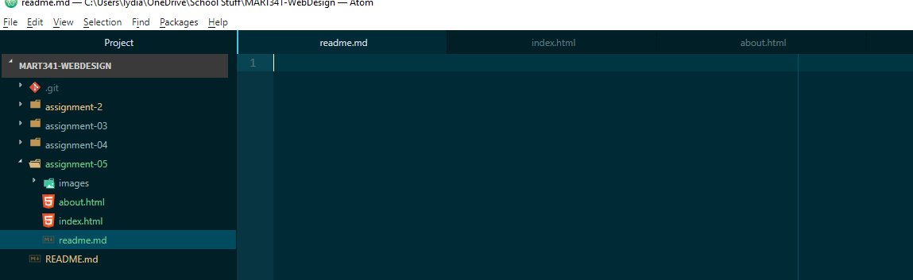

Using the wayback machine, I visited the homepage for the Whitehouse in the year 2012. It looks like many current news sites. It had links to recent events, a blog, a slideshow of images, and a link to create and sign petitions. The format is more chunky than the modern site. The current whitehouse.gov site is more rounded, takes up the entire screen, and has a much more mainstream and isolated appearance. In 2012 the homepage was cluttered and blocky, while in 2022 it's condensed and more smooth in appearance. Both versions have many links that take you to specialized pages.  
