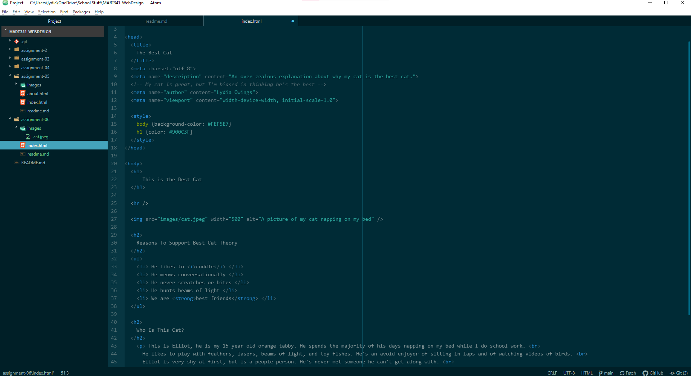

Structural markup refers to code that provides information about the structure of a document, it's like the information about the framework of a building. Structural markup tells us about things like lists and paragraphs. Semantic markup is used to enhance meaning about how the information within a document should be interpreted by a reader. Semantic information is used for things like emphasis and definitions to help strengthen the point and meaning of content.

