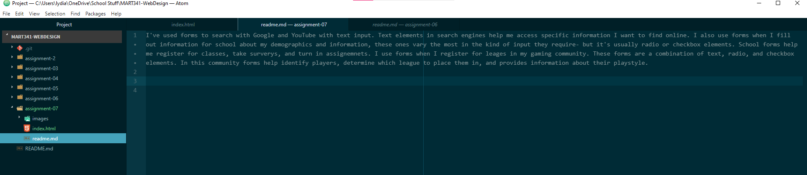

I've used forms to search with Google and YouTube with text input. Text elements in search engines help me access specific information I want to find online. I also use forms when I fill out information for school about my demographics and information, these ones vary the most in the kind of input they require- but it's usually radio or checkbox elements. School forms help me register for classes, take surveys, and turn in assignments. I use forms when I register for leagues in my gaming community. These forms are a combination of text, radio, and checkbox elements. In this community forms help identify players, determine which league to place them in, and provides information about their playstyle.

