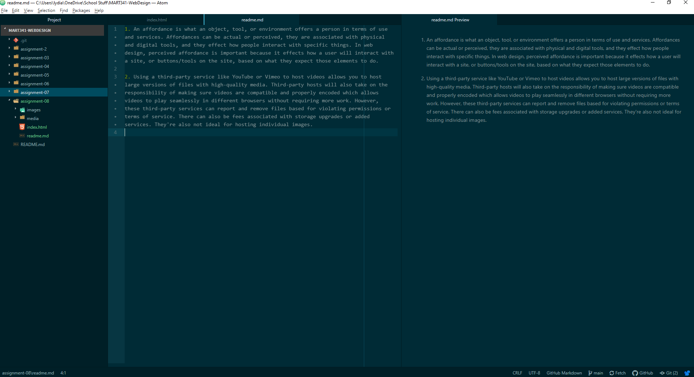

1. An affordance is what an object, tool, or environment offers a person in terms of use and services. Affordances can be actual or perceived, they are associated with physical and digital tools, and they effect how people interact with specific things. In web design, perceived affordance is important because it effects how a user will interact with a site, or buttons/tools on the site, based on what they expect those elements to do.

2. Using a third-party service like YouTube or Vimeo to host videos allows you to host large versions of files with high-quality media. Third-party hosts will also take on the responsibility of making sure videos are compatible and properly encoded which allows videos to play seamlessly in different browsers without requiring more work. However, these third-party services can report and remove files based for violating permissions or terms of service. There can also be fees associated with storage upgrades or added services. They're also not ideal for hosting individual images.  

 
