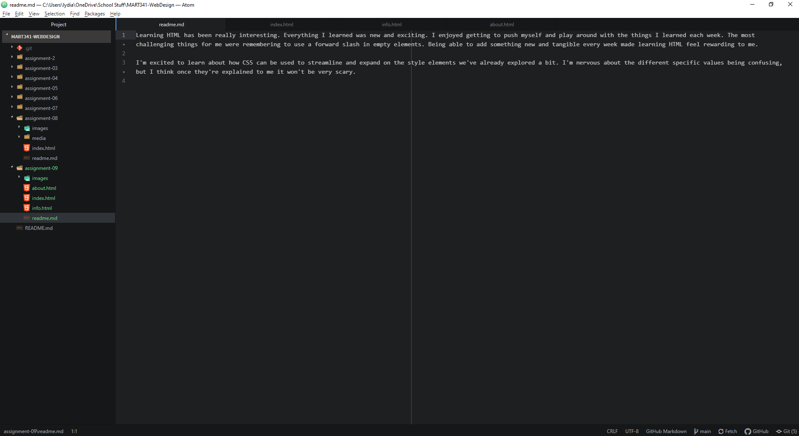

Learning HTML has been really interesting. Everything I learned was new and exciting. I enjoyed getting to push myself and play around with the things I learned each week. The most challenging things for me were remembering to use a forward slash in empty elements. Being able to add something new and tangible every week made learning HTML feel rewarding to me.

I'm excited to learn about how CSS can be used to streamline and expand on the style elements we've already explored a bit. I'm nervous about the different specific values being confusing, but I think once they're explained to me it won't be very scary.  

