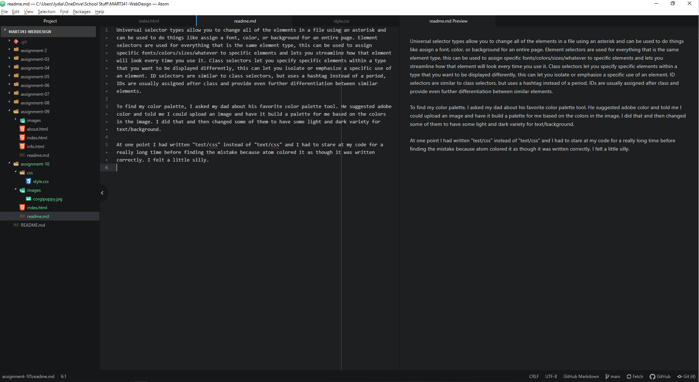

Universal selector types allow you to change all of the elements in a file using an asterisk and can be used to do things like assign a font, color, or background for an entire page. Element selectors are used for everything that is the same element type, this can be used to assign specific fonts/colors/sizes/whatever to specific elements and lets you streamline how that element will look every time you use it. Class selectors let you specify specific elements within a type that you want to be displayed differently, this can let you isolate or emphasize a specific use of an element. ID selectors are similar to class selectors, but uses a hashtag instead of a period, IDs are usually assigned after class and provide even further differentiation between similar elements.

To find my color palette, I asked my dad about his favorite color palette tool. He suggested adobe color and told me I could upload an image and have it build a palette for me based on the colors in the image. I did that and then changed some of them to have some light and dark variety for text/background.

At one point I had written "test/css" instead of "text/css" and I had to stare at my code for a really long time before finding the mistake because atom colored it as though it was written correctly. I felt a little silly.

 
