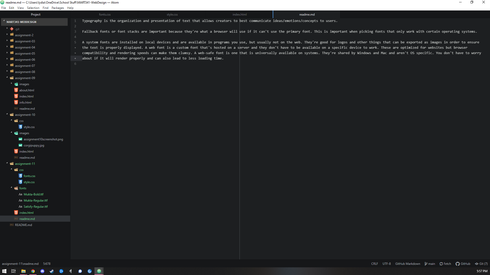

Typography is the organization and presentation of text that allows creators to best communicate ideas/emotions/concepts to users.

Fallback fonts or font stacks are important because they're what a browser will use if it can't use the primary font. This is important when picking fonts that only work with certain operating systems.

A system fonts are installed on local devices and are available in programs you use, but usually not on the web. They're good for logos and other things that can be exported as images in order to ensure the text is properly displayed. A web font is a custom font that's hosted on a server and they don't have to be available on a specific device to work. These are optimized for websites but browser compatibility and rendering speeds can make them clumsy. A web-safe font is one that is universally available on systems. They're shared by Windows and Mac and aren't OS specific. You don't have to worry about if it will render properly and can also lead to less loading time.

