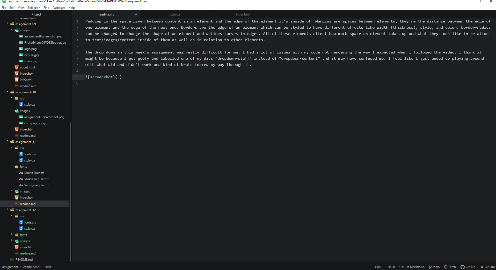

Padding is the space given between content in an element and the edge of the element it's inside of. Margins are spaces between elements, they're the distance between the edge of one element and the edge of the next one. Borders are the edge of an element which can be styled to have different effects like width (thickness), style, and color. Border-radius can be changed to change the shape of an element and defines curves in edges. All of these elements effect how much space an element takes up and what they look like in relation to text/images/content inside of them as well as in relation to other elements.

The drop down in this week's assignment was really difficult for me. I had a lot of issues with my code not rendering the way I expected when I followed the video. I think it might be because I got goofy and labelled one of my divs "dropdown-stuff" instead of "dropdown-content" and it may have confused me. I feel like I just ended up playing around with what did and didn't work and kind of brute forced my way through it.

